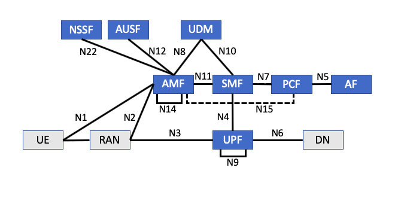

# 5G_cn (NSSF)

### Introduction
The purpose of this project is to implement the NSSF component of the 5G Core Network in Java
NSSF: stands for The Network Slice Selection Function selects the Network Slice Instance (NSI) 
based on information provided during UE attach. A set of Access and Mobility Management Function 
(AMF) are provided to the UE based on which slices the UE has access to. The Network Exposure Function 
(NEF) exposes the overall 5G core network services and capabilities.
          
          
The Network Repository Function (NRF) maintains the network function profile and performs service discovery within a slice.
The three primary network functions of the core network (CN) are the Access and Mobility Management Function (AMF), 
Session Management Function (SMF), and User Plane Function (UPF). These functions handle the mobility management, 
application session management, and application content flows through the core network.

### Creating Slices

A network slice is defined as an end-to-end logical communications network within a mobile network and includes the core
 network, control plane, user plane functions and 5G access network. Mobile operators intend to use these network slices to house isolated service applications for tenants much like cloud providers sell their compute, storage, and memory resources.
The idea is a customer will provide their bandwidth, capacity, and latency requirements for the application they want to 
run on a network slice. The mobile operator does a requirements analysis based on current network status and load, creates a service level agreement, and allocates the necessary capacity and bandwidth for the slice. Once the slice is created, the tenant runs their application using the network slice and they can be assured the network slice will adhere to the service level agreement.

### References
https://www.embeddedcomputing.com/application/networking-5g/5g-primer-part-3-5g-core-network
3GPP TS 29.531 
